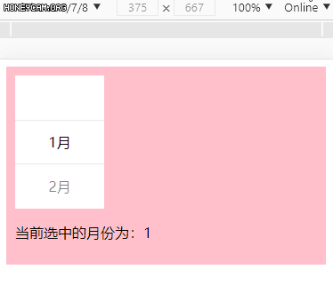

# react-scroll-picker

> 使用 React 进行开发的适用于移动端的滚动选择器

## 预览



## 属性说明

### data

提供选择的数组数据，形如：

```js
const data = [
  {
    label: "选项1",
    value: "此选项的值",
  },
  {
    label: "选项2",
    value: "此选项的值",
  },
];
```

### value

绑定选中的值，如果一开始为空，会默认选择第一个元素。

### onChange

与 `value` 搭配使用，当选中的值发生改变会触发回调。 `function onChange: (value, item) => void ` 。